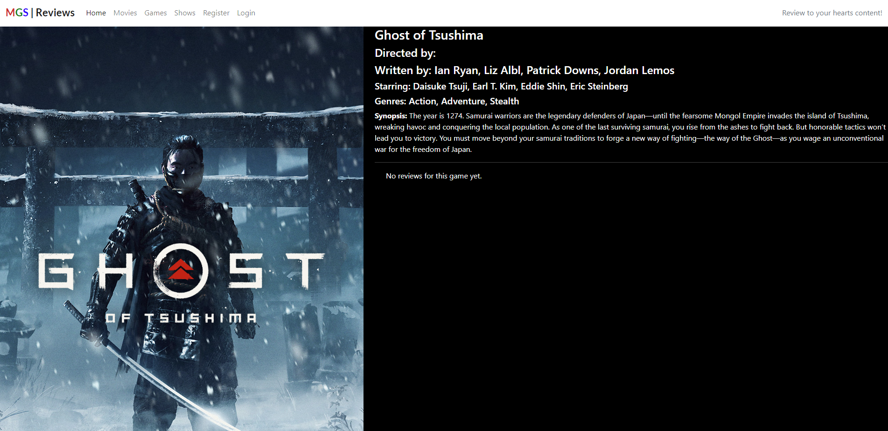
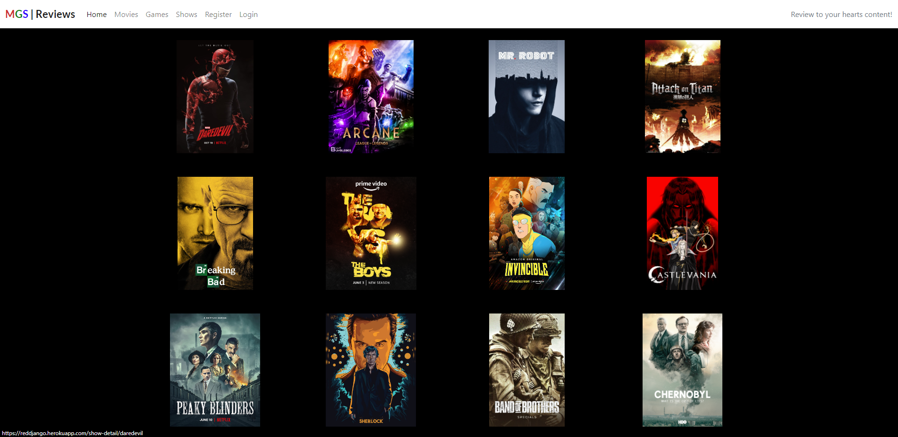

# MGSR - Movies, Games, Shows Reviews

This is an extension of a website I made for my first project and it's a review website for anyone that loves Movies, Games, TV Shows and want to express how they feel about said media. The main purpose is to get some healthy non-toxic reviews and perspectives about media that we all know and love and even some that we don't know nor love, if theres something that you haven't seen or played and are abit skeptical about it then feel free to read the reviews and go from there!

The website can be viewed here. [MGSR](https://reddjango.herokuapp.com/)

# Index - Table of Contents

- [User Experience (UX)](https://github.com/ShaneCDev/reddango#user-experience-ux)
- [Features](https://github.com/ShaneCDev/reddango#features)
- [Technologies Used](https://github.com/ShaneCDev/reddango#technologies-used)
- [Testing](https://github.com/ShaneCDev/reddango#testing)
- [Deployment](https://github.com/ShaneCDev/reddango#deployment)
- [Credits](https://github.com/ShaneCDev/reddango#credits)
- [Acknowledgments](https://github.com/ShaneCDev/reddango#acknowledgments)

# User Experience (UX)

## User Stories

- ## As a website owner I want:
1. The website to provide clear and concise information about Movies, Games, and TV Shows.
2. The website allows users to create an account.
3. The website allows users to leave a review.
4. The website allows users to edit their review because I don't want to allow double posting on the website as it can clutter the page.

- ## As a website user I want:
1. To easily understand the main purpose of the website.
2. To get information about different types of media.
3. To be able to create an account.
4. To be able to leave a review for different pieces of media.
5. To be able to edit my review.

- ## As a returning website user I want:
1. To check out other people's reviews.
2. Change my review and review score if my opinion should change.

# 1. Strategy
- The main purpose of the site is to provide lovers of media with a place where they can voice and express their opinions.

# 2. Scope
- The multipage design is simple and the information provided is clear and concise.
- The information can be accessed on all devices.

# 3. Structure
- Users will find themselves on the homepage where they will be met by three carousels (slideshows) of Movies, Games, and TV Shows and clicking on any of these images will bring them to the respective page. Users will also see a navigation bar at the top of the screen.
- The fixed nav bar has a logo on the left and the navigation items positioned slightly to the right
- The Movies, Games, and Shows sections all provide information on 12 items that are layed out in a 4x4 grid.
- Within the 4x4 grid if you click on an item it will bring you to a detail page of said item so for example if its a movie you click on, the detail page will show you who directed it, wrote it, stars in it, plot synopsis and finally the genres.
- On the detail page there is also a green "Leave A Review" button if the user is logged in and just reviews if there are any for users that are not logged in.
- Clicking on the "Leave A Review" button will take you to the review page which displays a form to the user to fill out upon submitting the form the user will be redirected to the page they just came from and their review will be displayed there.
- There is also an edit button on the reviews that the user wrote, upon clicking on that button it will bring you to the edit-review page where the user can edit their review as they see fit and upon submitting the form the review will be updated and the user redirected back to the page they just came from.
- The footer sections provides the user with social media links to follow the hosts of the 
site.

# 4. Skeleton
## Wireframes
The wireframes were made using Balsamiq.
- [Home](docs/wireframes/homepagewireframe.png)
- [Movies, Games, Shows](docs/wireframes/mgs%20pages%20wireframes.png)
- [Detail Page](docs/wireframes/detailpageswireframe.png)
- [Review, Edit Review](docs/wireframes/reviewwireframe.png)
- [Register](docs/wireframes/signupwireframe.png)
- [Login](docs/wireframes/signinwireframe.png)
- [Signout](docs/wireframes/signoutwireframe.png)

# 5. Surface
- ## Colour


The colour palette is basic enough but I think its clean and nice, it consists of a black background contrasted by white text. Its simple but effective in my opinion.

- ## Font
---
'Roboto' and 'Lato' fonts are used for this website.

# Features
## Existing Features

## Navigation Bar

- The navigation bar is fixed for this multi-paged website.
- There is a very simple "MGS | Reviews" logo located to the left of the navigation bar, located slightly to the right of the logo is each page and depending on if the user is logged in or not this will look different. If the user is logged in then the navbar links will be "Home, Movies, Games, Shows, Logout" if they are not logged in then it will be as follows "Home, Movies, Games, Shows, Register, Login".
- The logo acts as a button also and clicking on it will redirect you back to the home page.
- The navbar is responsive as on smaller devices it will turn into a hamburger menu that holds all the links and the logo.
- Upon clicking on any navigation link the website will redirect you to the respective page.

## Home Page

- The home page is made up of three carousels which I think is a nice way of displaying different media.
- The page is evenly divided into three rows, each image in the carousel is clickable and clicking on any of them will bring the user to the detail page for whatever they clicked on for example if the user clicks on Sekiro they will be brought to the Sekiro detail page.

## Movies

- This is the movies page and it is a 4x4 grid of twelve movies posters which are easily recognisable and upon clicking on them the user will be brought to the detail page.
- This layout is shared across the Games, and Shows pages also to keep things consistent.

## Movie Detail

- This detail page is also shared across Games, and Shows with some minor details in the data that is displayed to the user.
- There is also a "Leave A Review" button that will be on this page if the user is logged in and has not yet left a review.
- If there are no reviews for the movie then "No reviews for this movie yet" will be displayed.
- If the user has already left a review the review will be displayed here in a little card and at the bottom of the card will be an edit button should they wish to edit their review.

## Games


## Games Detail


## Shows


## Shows Detail


## Review

- This is the page the user will be brought to upon clicking the "Leave A Review" button.
- This page consists of a form for the user to fill out which upon submitting will redirect them back to the page they just came from and post their review for all users to see.
- I implemented pagination as to not clutter the page too much so there is only three reviews showing at a time.
- This design is shared with the "edit review" page. The only difference being is that instead of the form being blank it is already filled out with your review that can be edited to your liking.

## Edit Review


# Technologies Used

- ## Languages / Frameworks
1. [HTML5](https://en.wikipedia.org/wiki/HTML5)
2. [CSS3](https://en.wikipedia.org/wiki/CSS)
3. [Python](https://en.wikipedia.org/wiki/Python_(programming_language))
4. [JavaScript](https://en.wikipedia.org/wiki/JavaScript)
5. [Django](https://www.djangoproject.com/)
6. [Bootstrap](https://getbootstrap.com/)

- ## Misc Software
- [Balsamiq](https://balsamiq.com/) : Wireframes built using Balsamiq.
- [GitHub](https://github.com/) : GitHub is used as a repository storage for the project.
- [Gitpod](https://gitpod.io/) : Gitpod was used as a development environment, and code was pushed to GitHub. It is used for version control as well as it allows you to commit code at different stages of development as required.

# Testing
- ## HTML Validator
    At various stages HTML Validation was done.
    

- ## CSS Validator
    At various stages CSS Validation was done.
    

- ## Lighthouse
    At various stages Lighthouse testing was done.
    

- ## Browser Compatibility
The website was tested on the following browsers:
- Google Chrome: Version 111.0.5563.147 (Official Build) (64-bit)
- Mozilla Firefox: Version 104.0.2 (64-bit)
- OperaGX: Version 90.0.4480.100

- # Manual Testing
The following was manually tested and resulted in a pass:
- ## Navigation Bar
    - The "MGSR" logo takes you back to the homepage when clicked.
    - The navigation links take the user to their respective pages when clicked.
    - The navbar is responsive so on smaller screens it turns into a hamburger menu.
- ## Home Page
    - Each item in three carousels are clickable and take you to the correct page upon doing so.
    - The home page is responsive on smaller devices.
- ## Movies, Games, Shows Page
    - Each item in the 4x4 grid is clickable and takes you to the correct page.
- ## Movies, Games, Shows Detail
    - Clicking on the "Leave A Review" button takes the user to a new page with a review form to fill out and upon submitting the review is saved and displayed succesfully.
    - Reviews are displayed and paginated so that there is only three reviews showing at a time.
    - The edit button works as intended as it takes the user to the edit review page and allows them to edit their review and save it as they see fit.
- ## Review Page
    - Upon submitting the review form the user is redirected back to the page they just came from and their review is there on display.
    - Users can only leave one review, so there is no double posts instead if they have already left a review they can edit the one they posted.
- ## Register Page
    - Filling out this form allows users to register an account so that they can leave and edit reviews.
- ## Sign in Page
    - Upon entering in your credentials you will be logged in to the website and an alert message displays letting you know that you logged in successfully.
- ## Sign out Page
    - Upon clicking the sign out button the user is logged out and an alert message letting the user know that they signed out is displayed.
- ## Footer
    - All social media links open in a new tab.
---
- # Future Implementation
    - I would like to add user profiles so users can assign an avatar to their profile and that can be displayed on their reviews, and they can also edit their account details for example changing username, password, email etc.
    - Add "like" button functionality to reviews and filter reviews based on the most likes.
    - Add an API (if one exists) that can pull in new Movies, Games and Shows without the admin having to manually enter them via the admin panel.

# Deployment
The website was deployed using Heroku. To deploy to Heroku:
1. To successfully deploy on Heroku you first need to create a requirements.txt file and a Procfile.
2. The requirements.txt file contains all the applications and dependencies that are required to run your application. To create this file run the following command in the terminal:
```bash
pip3 freeze --local > requirements.txt    
```
3. The Procfile lets Heroku know which files run the app and how to run it. Create a `Procfile` in the root directory and add the following to the file (note: you must install gunicorn, you can do this by running this command. `pip3 install gunicorn`):
```Procfile
web: gunicorn yourappname.wsgi
```
4. Log in to the Heroku CLI in the terminal and run this command to disable collectstatic. (You don't have to do this in the CLI you can go to your config vars via the Heroku Dashboard and add this config var `DISABLE_COLLECTSTATIC 1`):
```bash
heroku config:set DISABLE_COLLECTSTATIC=1 --app heroku-app-name-here
```
5. We also need to add the Heroku app and localhost to ALLOWED_HOSTS = [] in settings.py:
```python
ALLOWED_HOSTS = ['{heroku app URL here}', 'localhost']
```
6. Push these changes to GitHub. You can then initialise the Heroku git remote in the terminal and push to Heroku with:
```bash
heroku git:remote -a {app name here}
git push heroku master
```
7. You should now be able to see your deployed site (without any static files).
8. To enable automatic deployments on Heroku, go to the deploy tab and click the connect to GitHub button. Search for your projects repo and then click connect. Click enable automatic deploys at the bottom of the page. Now everytime you push code to GitHub Heroku will take that code and deploy the site again with the updated code you just added.
9. To enable stylesheets just remove the `DISABLE_COLLECTSTATIC` config var and your site will have all its styling.

### Local Development
#### How to Fork
To fork the repo:
1. Log in to GitHub.
2. Go to the repo for this project.
3. Click on the fork button in the top right.

#### How to Clone
To clone the repo:
1. Log in to GitHub
2. Go to the repo for this project.
3. Click the Code button, select whether you would like to clone with HTTPS, SSH or the GitHub CLI and copy the link given.
4. Open the terminal in any IDE of your choosing and change the current working directory to the location you would like to use for the cloned repo.
5. Type the following command into the terminal `git clone` followed by the link you copied in step 3.
6. Set up a virtual environment.
7. Install the packages that are required from the requirements.txt file by running the following command in the terminal:
```bash
pip3 install -r requirements.txt
```

The website can be viewed here. [MGSR](https://reddjango.herokuapp.com/)

# Credits
- ## Images
- All images were taken from [Google Images](https://www.google.ie/imghp?hl=en-GB&tab=ri&ogbl).
- [Am I Responsive](https://ui.dev/amiresponsive) was used to generate the website responsive image used here in the README.md.
- [Ezgif](https://ezgif.com/) for converting some images from webp to jpg.

- ## Coding
- [Bootstrap Docs](https://getbootstrap.com/docs/5.0/getting-started/introduction/)
- [Django Docs](https://docs.djangoproject.com/en/4.2/)

# Acknowledgments
I would like to thank:
- Rahul Lakhanpal for his feedback and guidance while working on this project.
- The Slack Community.